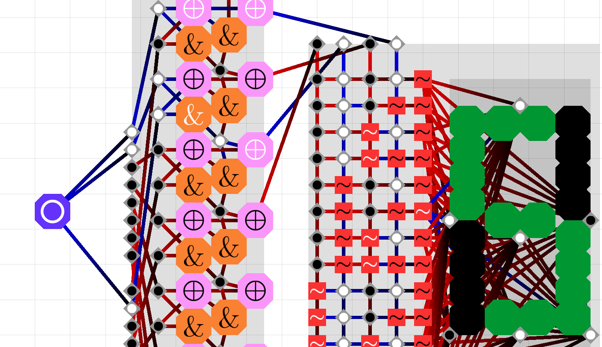

# Sircuit
SFML 2D drag'n'drop logic circuit simulator. A descendant of [CCircuit](https://github.com/phunanon/CCircuit).

## Features

* Objects: AND, OR, XOR, NOT, Switch, Randomiser, Bit (flip-flop), Indicator, Panel
* Pan & zoom
* Load & save, both board & component
* (Hopefully) smooth graphics
* Snap-to-grid, visible when zoomed in
* Pause & step
* Probably cross-platform
* Pre-built 8-bit components: adder, incrementer, 7-segment display, Read/Write memory

## Download, Build, and Run

On Debian et al:

    sudo apt install libsfml-dev cmake make
    git clone --depth=1 https://github.com/phunanon/Sircuit.git
    cd Sircuit && mkdir build && cd build
    cmake ../src
    make
    ./Sircuit

## Controls

* **left-click & drag**: pan screen, move objects, move panels and their objects, and select panel as a 'component'
* **left-click**: start or end object-to-object connection
* **right-click**: 'click' some objects for functionality (e.g. Switch, Bit), create object-to-object connection
* **left-click + left-shift**: delete object
* **F1**: pause/unpause
* **F2**: step
* **left-ctrl + O**: Open session
* **left-ctrl + S**: Save session
* **left-ctrl + I**: Insert component
* **left-ctrl + C**: Save component
* **C**: Copy component
* **A**ND, **O**R, **X**OR, **N**OT, **S**witch, **R**andomiser, **B**it, **I**ndicator, **P**anel

Also, **left-alt** can be left-click, **space** can be right-click.
